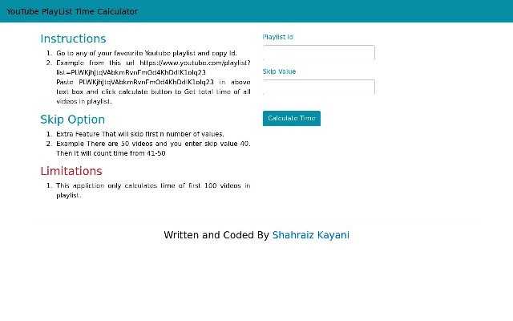

# YouTube-Playlist-App
It Calculates Time of Videos in You Tube Playlist 

**Tier:** 2-Intermediate

It Scrapes Total time from YouTube Vidoes in Playlist.

## Instructions

- [ ] Go to any of your favourite Youtube playlist and copy Id.
- [ ] Example from this url https://www.youtube.com/playlist?list=PLWKjhJtqVAbkmRvnFmOd4KhDdlK1oIq23.
- [ ]  Paste PLWKjhJtqVAbkmRvnFmOd4KhDdlK1oIq23 in above text box and click calculate button to Get total time of all videos in playlist.
  
  ## Skip Feature
- [ ] Extra Feature That will skip first n number of values.
- [ ] Example There are 50 videos and you enter skip value 40. Then It will count time from 41-50.
  

## Bonus features (Not Implemented)

- [ ] The app should display have a Take Option i.e. that will calculate time of first n number of videos. 

 ## Limitations
 - [ ] This appliction only calculates time of first 100 videos in playlist.

## Uploaded on Somee

- [PlayList App Created By Shahraiz Kayani](http://www.youtubeplaylistapp.somee.com/)

